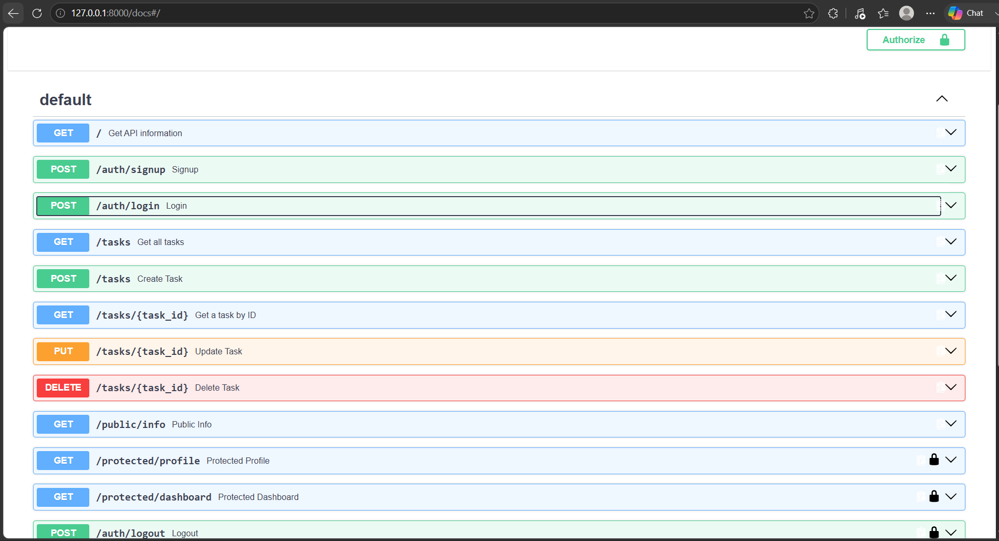

# Task API

A FastAPI CRUD application using PostgreSQL running in Docker.

## Architecture

The application separates the API layer from database access.

```text
Routes → TaskRepository → PostgreSQL

Running the Application

docker compose up --build

The API is available at:

http://localhost:8000

Swagger documentation:

http://localhost:8000/docs

